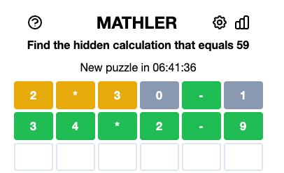
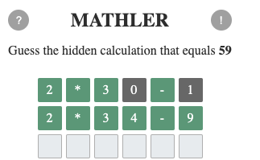

# Mathler - equation guessing game

## Live demo

https://mathler-guessing-game.netlify.app/

## Running the app

Run `npm install` to install dependencies

Run `npm start` to start for dev development

## What is it?

This is mainly a clone of a popular mini-game [Mathler](https://www.mathler.com/).

Given a result value and number of characters (digits and operators), you need to guess the equation exactly in 6 guesses.

The app allows for guessing a daily puzzle with an option of retrying in case of failure. When you complete a solution, you can then keep solving a random puzzle out of the hard-coded pool of equations. When the app runs out of new puzzles to solve, user get repeats out of the same pool.

## One major difference versus original Mathler gameplay

Original Mathler supports all commutative solutions of an equation, e.g. if the calculation to guess is "34\*2-0" (=59), Mathler will also accept "2\*34-9" (the only equivalent solution in this case, as only "\*" is commutative and "-" is not).
However, the way the original app does it is to display all characters as being in the wrong place until you guess the whole equation. Then the app rearranges your solution to display the "correct" one.

See screenshot below. User input for 2nd row was actually "2\*34-9" but Mathler has rearranged it after validation since all numbers and operations were correct.

This is a bit confusing and I see no reason why it works that way, other than that it's easier to implement this way. That's why in this version of the app, the game will adapt to the solution variation user is the closest to, and will not rearrange characters.

Screenshot of the same gameplay in Mathler app from this repo:

The values on game board reflect exactly user input at every point and the game picked "2\*34-9" as the solution variation user is guided towards because it was the closest one to user input.

---

## Other commands

`npm run build` to run Typescript check and build the app bundle

`npm run test` to run tests suite or `npm run test:coverage` to run it and display coverage for the whole project

`npm run lint` to run linting

`npm run typecheck` to check for Typescript errors

`npm run format` to fix formatting using Prettier

---
